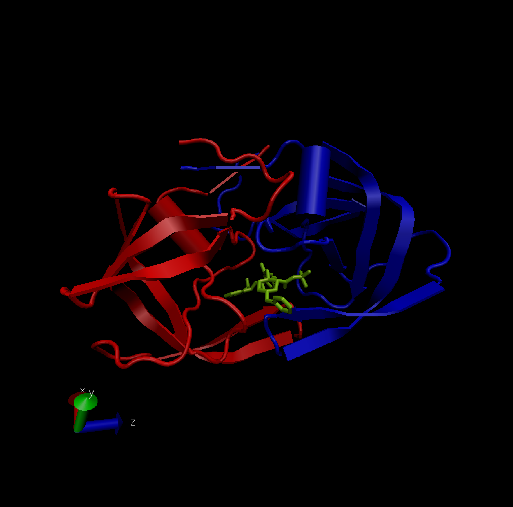
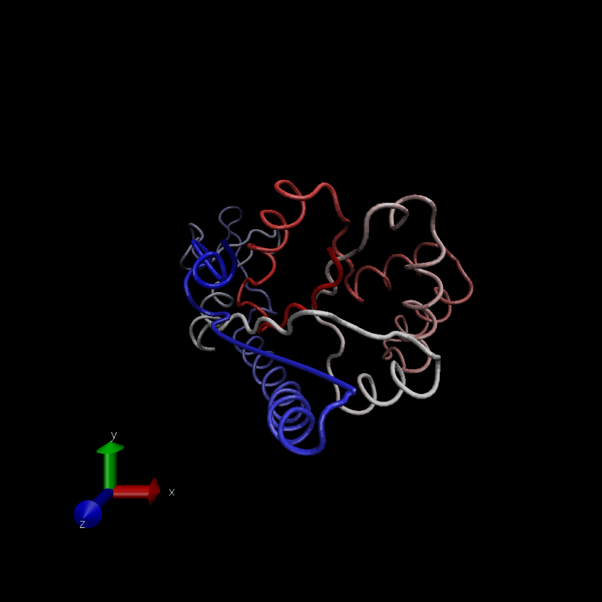

## 1: Introduction to the RCSB Protein Data Bank (PDB)

> Download a CSV file from the PDB site (accessible from “Analyze” >“PDB Statistics” > “by Experimental Method and Molecular Type”. Move this CSV file into your RStudio project and use it to answer the following questions:

> Q1: What percentage of structures in the PDB are solved by X-Ray and Electron Microscopy.

> Q2: What proportion of structures in the PDB are protein?

> Q3: Type HIV in the PDB website search box on the home page and determine how many HIV-1 protease structures are in the current PDB?

Lets import the csv file
```{r}
pdbstats <- read.csv("Data_Export_Summary.csv", row.names = 1)
pdbstats
```
Q1) To find the %structures in PDB solved by X-Ray:

```{r}
#First we find out the total number of structures: 
total <- sum(pdbstats[,7])
total
#Then we find the total number of structures solved by X-ray
total_xray <- sum(pdbstats[,1])
total_xray
#Then we find the total number of structures solved by EM: 
total_em <- sum(pdbstats[,3])
total_em
#Finally we divide the total number of structures solved by X-ray by total number of structures, and multiply by 100: 
perc_xray <- total_xray/total * 100
perc_xray
```
87.17% of structures are solved by X-ray. Repeating the same procedure for Electron Microscopy, 

```{r}
total_em <- sum(pdbstats[,3])
total_em
perc_em <- total_em/total*100
perc_em
```
5.39% of structures are solved by Electron Microscopy. 

Q2) To find what proportion of structures in the PDB are protein
```{r}
# We divide the number of protein only structures by the total number of structures. 
total_prot <- pdbstats[1,7]
total_prot/total

```
Therefore, the proportion of structures in PDB that are protein is 0.873. 

> Q3: Type HIV in the PDB website search box on the home page and determine how many HIV-1 protease structures are in the current PDB?

It is not easy to determine this from a text search for "HIV" or "HIV Protease" alone. A sequence search must be done to get much more reliable set of results. 

## 2. Visualizing the HIV-1 protease structure

> Q4: Water molecules normally have 3 atoms. Why do we see just one atom per water molecule in this structure?

This is because a VDW viewer was used to see the water molecules, and van der waals forces don't exist within individual atoms in a water molecule (hydrogen bonds exist within each molecule); they only exist between different water molecules. Hence, each water molecule acts as a single point that faces van der waals forces from another water molecule. 

> Q5: There is a conserved water molecule in the binding site. Can you identify this water molecule? What residue number does this water molecule have (see note below)?

This water molecule has residue #308. 

> Optional: Generate and save a figure clearly showing the two distinct chains of HIV-protease along with the ligand. You might also consider showing the catalytic residues ASP 25 in each chain (we recommend Licorice for these side-chains). Upload this figure to Piazza for some extra credit.

```{r}

```

Sent to instructors via piazza as a note as well(private note @103)

> As you have hopefully observed HIV protease is a homodimer (i.e. it is composed of two identical chains). With the aid of the graphic display and the sequence viewer extension can you identify secondary structure elements that are likely to only form in the dimer rather than the monomer?

Alpha helices. 

## 3. Introduction to Bio3D in R

```{r}
library(bio3d)
pdb <- read.pdb("1hsg")
#To get a quick summary of the contents of the pdb object you just created you can issue the command print(pdb) or simply type pdb (which is equivalent in this case):
pdb

```
> Q7: How many amino acid residues are there in this pdb object? 

This is given by the "residues/Calpha atoms" section. There are 198 amino acid residues in this pdb object. 

> Q8: Name one of the two non-protein residues? 

HOH or water is one of the non protein residues. This is given by the "Non-protein/nucleic resid values" section.

> Q9: How many protein chains are in this structure? 

There are two protein chains in this structure. The answer to this is in the "chains#" section. 

> Note that the attributes (+ attr:) of this object are listed on the last couple of lines. To find the attributes of any such object you can use:

```{r}
attributes(pdb)
```

To access these individual attributes we use the dollar-attribute name convention that is common with R list objects. For example, to access the atom attribute or component use pdb$atom:

```{r}
head(pdb$atom)
```
## 4. Comparative structure analysis of Adenylate Kinase

#Overview

> Starting from only one Adk PDB identifier (PDB ID: 1AKE) we will search the entire PDB for related structures using BLAST, fetch, align and superpose the identified structures, perform PCA and finally calculate the normal modes of each individual structure in order to probe for potential differences in structural flexibility.

# Setup

```{r}
# Install packages in the R console not your Rmd

#install.packages("bio3d")
#install.packages("ggplot2")
#install.packages("ggrepel")
#install.packages("devtools")
#install.packages("BiocManager")

#BiocManager::install("msa")
#devtools::install_bitbucket("Grantlab/bio3d-view")
```

> Q10) Which of the packages above is found only on BioConductor and not CRAN?

msa; this is a package we had to install from BioConductor(BiocManager)

> Q11) Which of the above packages is not found on BioConductor or CRAN?

bio3d-view. This had to be taken from the Grantlab website with the help of Devtools.

> Q12) True or False? Functions from the devtools package can be used to install packages from GitHub and BitBucket?

True

# Search and retrieve ADK structures

> Below we perform a blast search of the PDB database to identify related structures to our query Adenylate kinase (ADK) sequence. In this particular example we use function get.seq() to fetch the query sequence for chain A of the PDB ID 1AKE and use this as input to blast.pdb(). Note that get.seq() would also allow the corresponding UniProt identifier.

```{r}
library(bio3d)
aa <- get.seq("1ake_A")
aa
```
> Q13. How many amino acids are in this sequence, i.e. how long is this sequence?

There are 214 amino acids in this sequence. 

>Now we can use this sequence as a query to BLAST search the PDB to find similar sequences and structures.

```{r}
# Blast or hmmer search 

b <- blast.pdb(aa)
```
> The function plot.blast() facilitates the visualization and filtering of the Blast results. It will attempt to set a seed position to the point of largest drop-off in normalized scores (i.e. the biggest jump in E-values). In this particular case we specify a cutoff (after initial plotting) of to include only the relevant E.coli structures:

```{r}
# Plot a summary of search results

hits <- plot(b)
```
```{r}
# List out some 'top hits'
head(hits$pdb.id)
```
> The Blast search and subsequent filtering identified a total of 16 related PDB structures to our query sequence. The PDB identifiers of this collection are accessible through the $pdb.id attribute to the hits object (i.e. hits$pdb.id). Note that adjusting the cutoff argument (to plot.blast()) will result in a decrease or increase of hits.

> We can now use function get.pdb() and pdbslit() to fetch and parse the identified structures.

```{r}
#Download related PDB files 

files <- get.pdb(hits$pdb.id, path = "pdbs", split = T, gzip = T)
```
# Align and superpose structures

> Next we will use the pdbaln() function to align and also optionally fit (i.e. superpose) the identified PDB structures.

```{r}
# Align releated PDBs
pdbs <- pdbaln(files, fit = TRUE, exefile = "msa")
```

```{r}
#vector containing pdb codes for figure axis 

ids <- basename.pdb(pdbs$id)

#draw schematic adjustment 

plot(pdbs, labels = ids)
```


# Optional: Viewing our superposed structures

> We can view our superposed results with the new bio3d.view view() function:

```{r}
library(bio3d)
library(devtools)
library(bio3d.view)
library(rgl)

view.pdbs(pdbs)
```

# Annotate collected PDB structures [Optional]

> The function pdb.annotate() provides a convenient way of annotating the PDB files we have collected. Below we use the function to annotate each structure to its source species. This will come in handy when annotating plots later on:

```{r}
anno <- pdb.annotate(c("2mh3_A", "4f3l"), anno.terms = c("structureId", "experimentalTechnique", "resolution","pfam", "source", "citation"))
unique(anno$source)
```

>We can view all available annotation data:

```{r}
anno
```

This section didnt work as well. The response I got was "Error in split.default(X, group) : first argument must be a vector" 


#Principal component analysis

> Function pca() provides principal component analysis (PCA) of the structure data. PCA is a statistical approach used to transform a data set down to a few important components that describe the directions where there is most variance. In terms of protein structures PCA is used to capture major structural variations within an ensemble of structures. PCA can be performed on the structural ensemble (stored in the pdbs object) with the function pca.xyz(), or more simply pca().

```{r}
pc.xray <- pca(pdbs)
plot(pc.xray)
```
> Results of PCA on Adenylate kinase X-ray structures. Each dot represents one PDB structure.

> Function rmsd() will calculate all pairwise RMSD values of the structural ensemble. This facilitates clustering analysis based on the pairwise structural deviation:

```{r}
#calculate RMSD

rd <- rmsd(pdbs)

#structure based clustering 
hc.rd <- hclust(dist(rd))
grps.rd <- cutree(hc.rd, k=3)

plot(pc.xray, 1:2, col = "grey50", bg = grps.rd, pch = 21, cex = 1)
```
> Figure 10: Projection of Adenylate kinase X-ray structures. Each dot represents one PDB structure.

> The plot shows a conformer plot – a low-dimensional representation of the conformational variability within the ensemble of PDB structures. The plot is obtained by projecting the individual structures onto two selected PCs (e.g. PC-1 and PC-2). These projections display the inter-conformer relationship in terms of the conformational differences described by the selected PCs.

# 5. Optional further visualization

> To visualize the major structural variations in the ensemble the function mktrj() can be used to generate a trajectory PDB file by interpolating along a give PC (eigenvector):

```{r}
#visualize the first principal component 

pc1 <- mktrj(pc.xray, pc = 1, file = "pc_1.pdb")
```

> You can open this file, pc_1.pdb, in VMD, chose the “Drawing Method” Tube and “Coloring Method” Index. Then click the play button shown below to animate the structure and visualize the major structural variations along PC1.

```{r}

```
> We can also view our results with the new bio3d.view view() function:

```{r}
view.xyz(pc1)
```

> We could set the color to highlight the most variable regions like so:

```{r}
view.xyz(pc1, col=vec2color( rmsf(pc1) ))
```

> We can also plot our main PCA results with ggplot:

```{r}
#plotting results with ggplot2

library(ggplot2)
library(ggrepel)

df <- data.frame(PC1 = pc.xray$z[,1], PC2 = pc.xray$z[,2], col = as.factor(grps.rd), ids = ids)

p <- ggplot(df) + aes(PC1, PC2, col = col, label = ids) + geom_point(size = 2) + geom_text_repel(max.overlaps = 20) + theme(legend.position = "none") 

p
```

## 6. Normal Mode Analysis 

> Function nma() provides normal mode analysis (NMA) on both single structures (if given a singe PDB input object) or the complete structure ensemble (if provided with a PDBS input object). This facilitates characterizing and comparing flexibility profiles of related protein structures.

```{r}
# NMA of all structures 
modes <- nma(pdbs)
plot(modes, pdbs, col = grps.rd)
```

> Q14) What do you note about this plot? Are the black and colored lines similar or different? Where do you think they differ most and why?

The black and colored lines are very different, with the black lines having a shorter peak and lesser fluctuations. They differ the most in the residue number range of 125-160 and 25-75 and it is due to the fact that these are the residues involved in the binding site of the protein; upon ligand binding, the protein changes conformational state. This suggests that there are 2 binding sites on the protein as well.

> Collectively these results indicate the existence of two major distinct conformational states for Adk. These differ by a collective low frequency displacement of two nucleotide-binding site regions that display distinct flexibilities upon nucleotide binding.

```{r}
sessionInfo()
```

