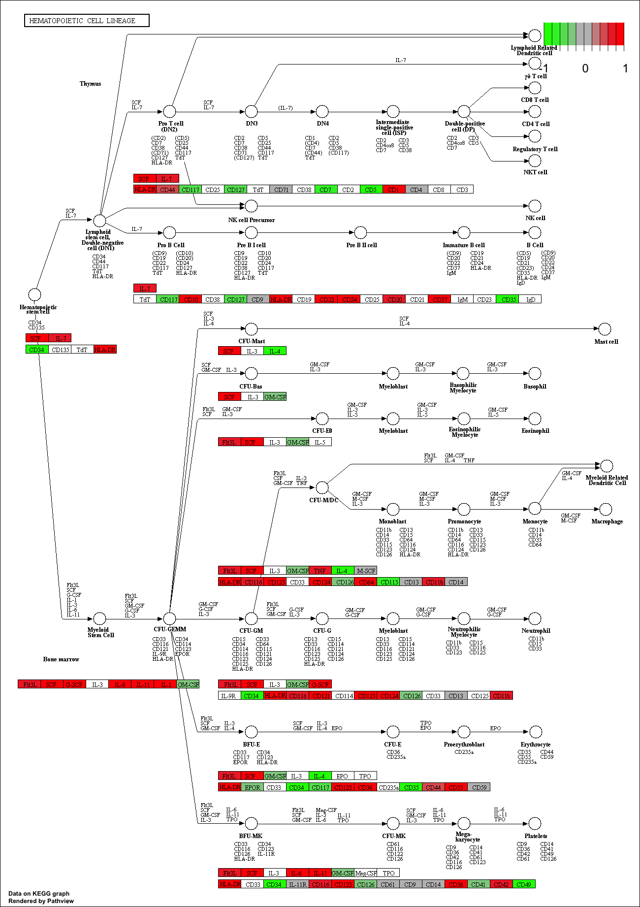
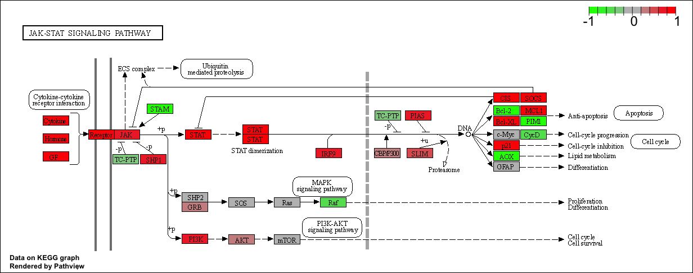
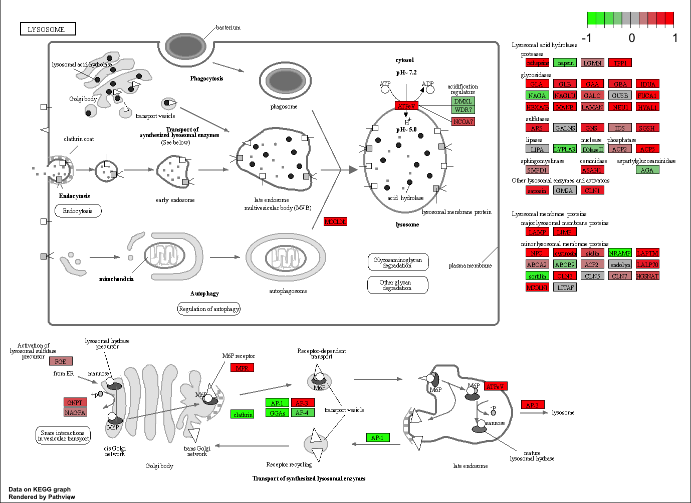
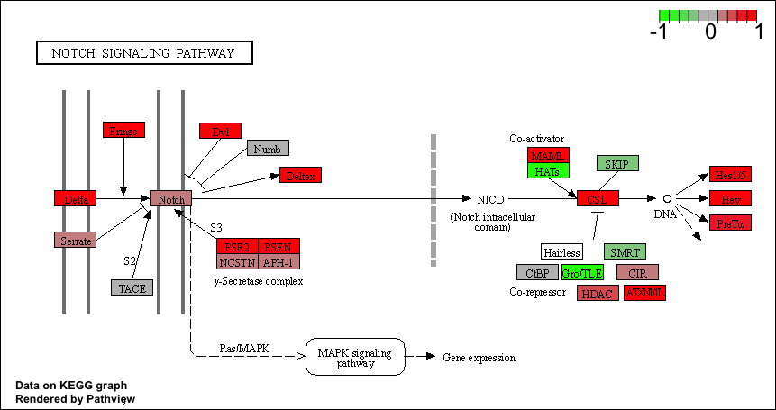
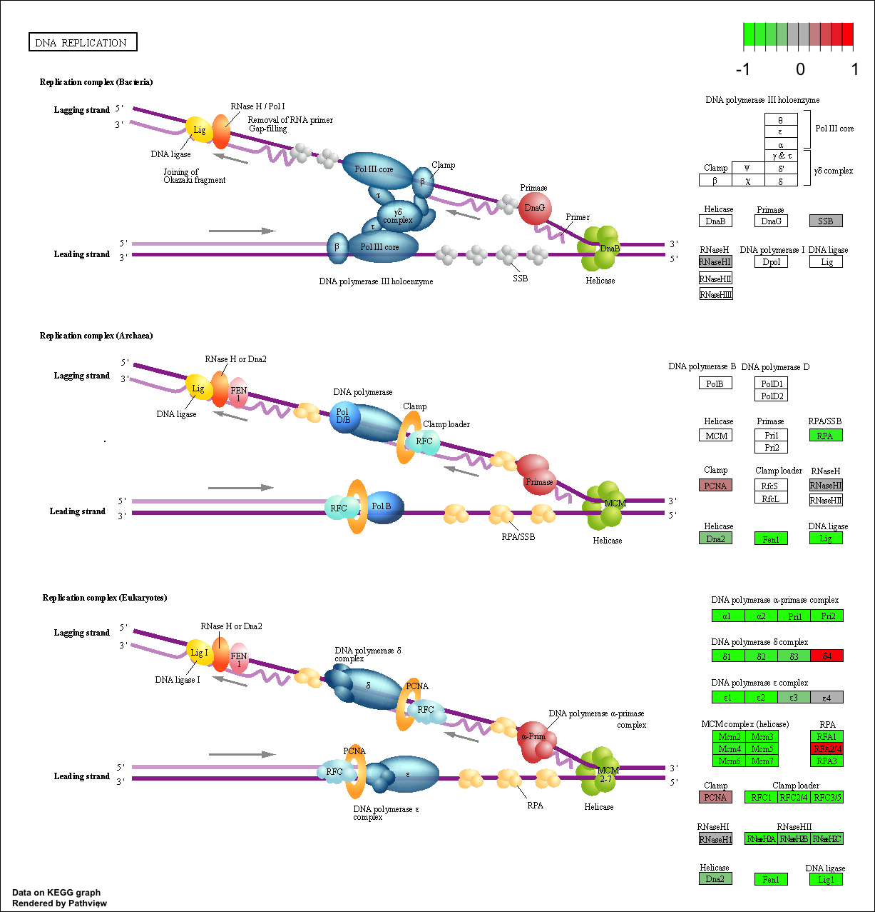
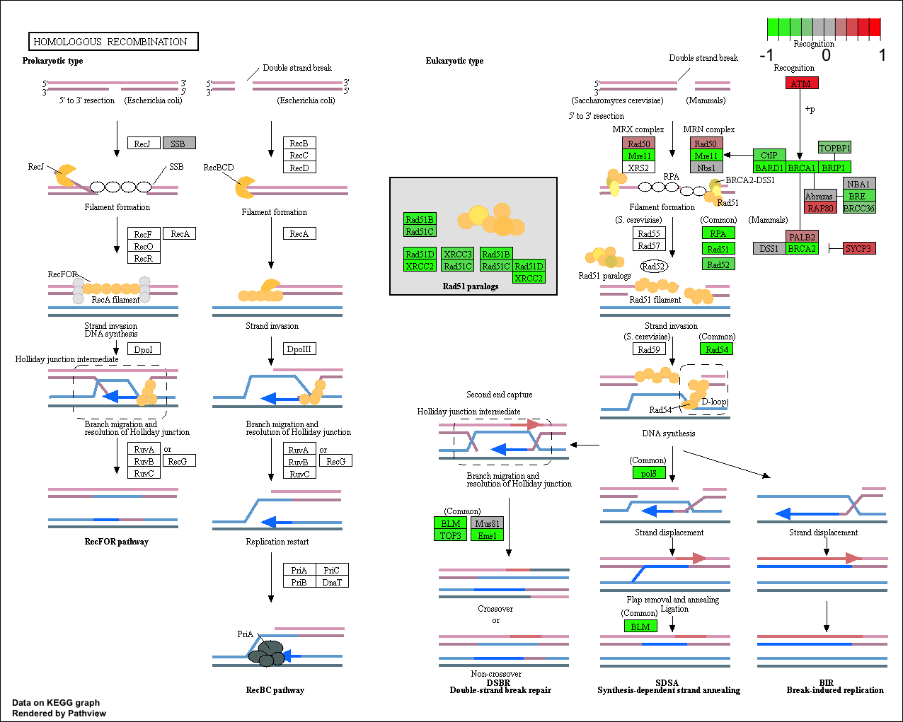
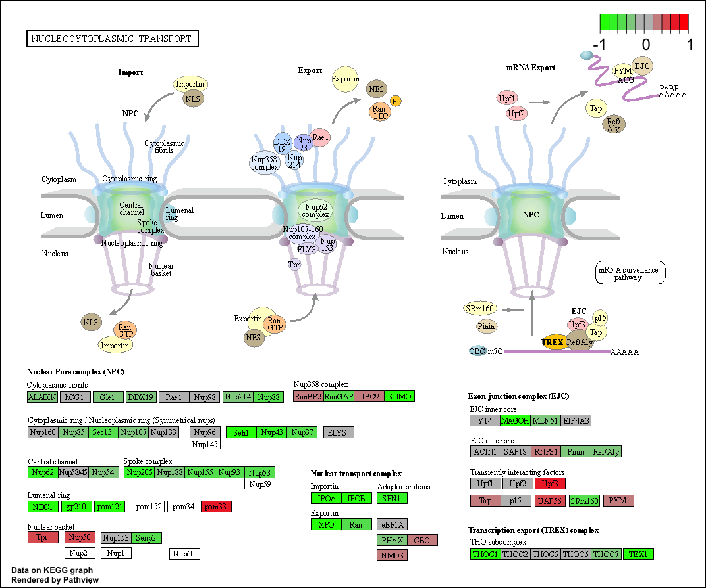
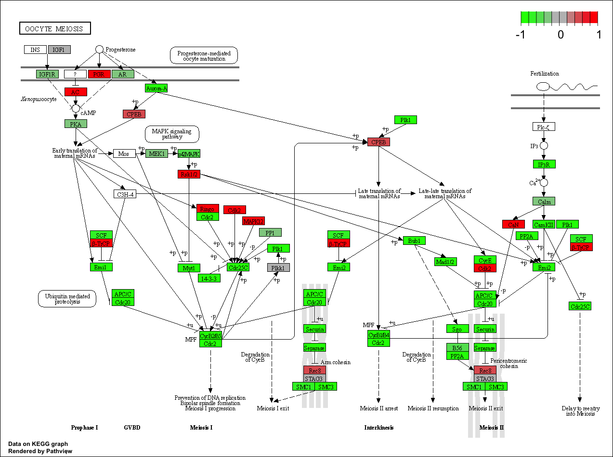

In this analysis, we check for coordinated differential expression over gene sets from KEGG pathways instead of changes of individual genes. The assumption here is that consistent perturbations over a given pathway (gene set) may suggest mechanistic changes.

There are many freely available tools for pathway or over-representation analysis. As of Nov 2017 Bioconductor alone has over 80 packages categorized under gene set enrichment and over 120 packages categorized under pathways.

Here we play with just one, the GAGE package (which stands for Generally Applicable Gene set Enrichment), to do KEGG pathway enrichment analysis on RNA-seq based differential expression results.

The KEGG pathway database, unlike GO for example, provides functional annotation as well as information about gene products that interact with each other in a given pathway, how they interact (e.g., activation, inhibition, etc.), and where they interact (e.g., cytoplasm, nucleus, etc.). 

# Section 1: Differential Expression Analysis 

First we need to load the DESeq package for differential expression analysis:

```{r}
library(DESeq2)
```

Great! Now we can load our data files, which we have downloaded from the following publication: Trapnell C, Hendrickson DG, Sauvageau M, Goff L et al. "Differential analysis of gene regulation at transcript resolution with RNA-seq". Nat Biotechnol 2013 Jan;31(1):46-53. PMID: 23222703

```{r}
metaFile <- "GSE37704_metadata.csv"
countFile <- "GSE37704_featurecounts.csv"

#Import metadata and take a peak 

colData = read.csv(metaFile, row.names=1)
head(colData)
```
```{r}
countData = read.csv(countFile, row.names=1)
head(countData)
```
Hmm... remember that we need the countData and colData files to match up so we will need to remove that odd first column in countData namely contData$length.

> Q1) Complete the code below to remove the troublesome first column from countData

```{r}
# Note we need to remove the odd first $length col
countData <- as.matrix(countData[,-1])
head(countData)
```

This looks better but there are lots of zero entries in there so let's get rid of them as we have no data for these.

> Q. Complete the code below to filter countData to exclude genes (i.e. rows) where we have 0 read count across all samples (i.e. columns).
Tip: What will rowSums() of countData return and how could you use it in this context?

```{r}
# Filter count data where you have 0 read count across all samples.
countData = countData[rowSums(countData) > 0, ]
head(countData)
```
## Running DESeq2 

Nice now lets setup the DESeqDataSet object required for the DESeq() function and then run the DESeq pipeline.

```{r}
dds = DESeqDataSetFromMatrix(countData=countData,
                             colData=colData,
                             design=~condition)
dds = DESeq(dds)
```
Great! Now lets look at the model we've created: 

```{r}
dds
```

Next, get results for the HoxA1 knockdown versus control siRNA (remember that these were labeled as "hoxa1_kd" and "control_sirna" in our original colData metaFile input to DESeq, you can check this above and by running resultsNames(dds) command).

```{r}
res = results(dds, contrast=c("condition", "hoxa1_kd", "control_sirna"))
```

> Q. Call the summary() function on your results to get a sense of how many genes are up or down-regulated at the default 0.1 p-value cutoff.

```{r}
#summary of HoxA1 knockdown

summary(res)
```
## Volcano Plot 

Now we will make a volcano plot, a commonly produced visualization from this type of data that we introduced last day. Basically it's a plot of log2 fold change vs -log adjusted p-value.

```{r}
plot( res$log2FoldChange, -log(res$padj) )
```

> Q) Improve this plot by completing the below code, which adds color and axis labels

```{r}
# make a color vector for all genes 

mycols <- rep("gray", nrow(res))

# color red the genes with absolute fold change above 2 

mycols[abs(res$log2FoldChange) > 2] <- "red"

# color blue those with adjusted p-value less than 0.01 and absolute fold change more than 2

inds <- (res$padj < 0.01) & (abs(res$log2FoldChange) > 2)
mycols[inds] <- "blue"

plot(res$log2FoldChange, -log(res$padj), col = mycols, xlab = "Log2(FoldChange)", ylab = "-Log(p-Value)")

```

## Gene Annotation 

Since we mapped and counted against the Ensembl annotation, our results only have information about Ensembl gene IDs. However, our pathway analysis downstream will use KEGG pathways, and genes in KEGG pathways are annotated with Entrez gene IDs. So lets add them as we did the last day.

> Q. Use the mapIDs() function multiple times to add SYMBOL, ENTREZID and GENENAME annotation to our results by completing the code below.

In order to do this, we first need to activate the annotation and human database libraries:
```{r}
library(AnnotationDbi)
library(org.Hs.eg.db)
```
Next, we can look at all the columns included in the human database: 

```{r}
columns(org.Hs.eg.db)
```

Now, to add symbol first: 

```{r}
res$symbol = mapIds(org.Hs.eg.db,
                    keys=row.names(res), 
                    keytype="ENSEMBL",
                    column="SYMBOL",
                    multiVals="first")

```
Next, we add ENTREZID: 

```{r}
res$entrez = mapIds(org.Hs.eg.db,
                    keys=row.names(res),
                    keytype="ENSEMBL",
                    column="ENTREZID",
                    multiVals="first")
```

Finally, we add GENENAME: 

```{r}
res$name =   mapIds(org.Hs.eg.db,
                    keys=row.names(res),
                    keytype= "ENSEMBL",
                    column= "GENENAME",
                    multiVals="first")
```

Checking out our results: 

```{r}
head(res, 10)
```

> Q. Finally for this section let's reorder these results by adjusted p-value and save them to a CSV file in your current project directory.

```{r}
res = res[order(res$pvalue),]
write.csv(res, file="deseq_results.csv")
```

Great, this is looking good so far. Now lets see how pathway analysis can help us make further sense out of this ranked list of differentially expressed genes.

# Section 2: Pathway Analysis 

Here we are going to use the gage package for pathway analysis. Once we have a list of enriched pathways, we're going to use the pathview package to draw pathway diagrams, shading the molecules in the pathway by their degree of up/down-regulation.

First we need to do our one time install of these required bioconductor packages, which was done on R console:

```{r}
# Run in your R console (i.e. not your Rmarkdown doc!)
#BiocManager::install( c("pathview", "gage", "gageData") )

# For old vesrsions of R only (R < 3.5.0)!
#source("http://bioconductor.org/biocLite.R")
#biocLite( c("pathview", "gage", "gageData") )
```

Now we can load packages as needed. 

```{r}
library(pathview)
```

```{r}
library(gage)
library(gageData)
```

```{r}
data("kegg.sets.hs")
data("sigmet.idx.hs")

#Focus on signalling and metabolic pathways only 

kegg.sets.hs <- kegg.sets.hs[sigmet.idx.hs]

#examine the first 3 pathways 

head(kegg.sets.hs, 3)
```

The main gage() function requires a named vector of fold changes, where the names of the values are the Entrez gene IDs.

Note that we used the mapIDs() function above to obtain Entrez gene IDs (stored in res$entrez) and we have the fold change results from DESeq2 analysis (stored in res$log2FoldChange).

```{r}
foldchanges = res$log2FoldChange
names(foldchanges) = res$entrez
head(foldchanges)
```

Now, lets run the gage pathway analysis. 

```{r}
#Get the results 

keggres = gage(foldchanges, gsets = kegg.sets.hs)
```

See help on the gage function with ?gage. Specifically, you might want to try changing the value of same.dir. This value determines whether to test for changes in a gene set toward a single direction (all genes up or down regulated) or changes towards both directions simultaneously (i.e. any genes in the pathway dysregulated). Here, we're using the default same.dir=TRUE, which will give us separate lists for pathways that are upregulated versus pathways that are down-regulated.

Now lets look at the object returned from gage().

```{r}
attributes(keggres)
```
It is a list with three elements, "greater", "less" and "stats".

You can also see this in your Environmnet panel/tab window of RStudio or use the R command str(keggres).

Like any list we can use the dollar syntax to access a named element, e.g. head(keggres$greater) and head(keggres$less).

Lets look at the first few down (less) pathway results:

```{r}
head(keggres$less)
```

Each keggres$less and keggres$greater object is data matrix with gene sets as rows sorted by p-value.

The top "less/down" pathways is "Cell cycle" with the KEGG pathway identifier hsa04110.

Now, let's try out the pathview() function from the pathview package to make a pathway plot with our RNA-Seq expression results shown in color.
To begin with lets manually supply a pathway.id (namely the first part of the "hsa04110 Cell cycle") that we could see from the print out above.

```{r}
pathview(gene.data = foldchanges, pathway.id = "hsa04110")
```

Note how many of the genes in this pathway are perturbed (i.e. colored) in our results.

You can play with the other input arguments to pathview() to change the display in various ways including generating a PDF graph. For example:

```{r}
# A different PDF based output of the same data
pathview(gene.data=foldchanges, pathway.id="hsa04110", kegg.native=FALSE)

```

Now, let's process our results a bit more to automagicaly pull out the top 5 upregulated pathways, then further process that just to get the pathway IDs needed by the pathview() function. We'll use these KEGG pathway IDs for pathview plotting below.

```{r}
keggrespathways <- rownames(keggres$greater)[1:5]

#Extract the 8 character long IDs part of each string
keggresids <- substr(keggrespathways, start = 1, stop = 8)
keggresids
```
Finally, lets pass these IDs in keggresids to the pathview() function to draw plots for all the top 5 pathways.

```{r}
pathview(foldchanges, pathway.id = keggresids, species = "hsa")
```






> Q) Can you do the same procedure as above to plot the pathview figures for the top 5 down-reguled pathways?

In order to do this, lets put the top 5 down regulated pathways in a different variable: 

```{r}
keggresdown <- row.names(keggres$less)[1:5]
keggresdown
```

```{r}
#Extract the 8 character long IDs part of each string
keggresid_down <- substr(keggresdown, start = 1, stop = 8)
keggresid_down
```

Now, to get the pathways of each of them: 

```{r}
pathview(foldchanges, pathway.id = keggresid_down, species = "hsa")
```






# Section 3: Gene Ontology

We can also do a similar procedure with gene ontology. Similar to above, go.sets.hs has all GO terms. go.subs.hs is a named list containing indexes for the BP, CC, and MF ontologies. Let’s focus on BP (a.k.a Biological Process) here.

```{r}
data(go.sets.hs)
data(go.subs.hs)

# Focus on Biological Process subset of GO
gobpsets = go.sets.hs[go.subs.hs$BP]

gobpres = gage(foldchanges, gsets=gobpsets, same.dir=TRUE)

lapply(gobpres, head)
```

# 4. Reactome Analysis

Reactome is database consisting of biological molecules and their relation to pathways and processes. Reactome, such as many other tools, has an online software available (https://reactome.org/) and R package available (https://bioconductor.org/packages/release/bioc/html/ReactomePA.html).

Let's now conduct over-representation enrichment analysis and pathway-topology analysis with Reactome using the previous list of significant genes generated from our differential expression results above.

First, Using R, output the list of significant genes at the 0.05 level as a plain text file:

```{r}
sig_genes <- res[res$padj <= 0.05 & !is.na(res$padj), "symbol"]
print(paste("Total number of significant genes:", length(sig_genes))) 
```
```{r}
write.table(sig_genes, file="significant_genes.txt", row.names=FALSE, col.names=FALSE, quote=FALSE)
```

Then, to perform pathway analysis online go to the Reactome website (https://reactome.org/PathwayBrowser/#TOOL=AT). Select “choose file” to upload your significant gene list. Then, select the parameters “Project to Humans”, then click “Analyze”.

> Q. What pathway has the most significant “Entities p-value”? Do the most significant pathways listed match your previous KEGG results? What factors could cause differences between the two methods?

Endosomal/Vacuolar pathway has the most significant Entities p-value. This doesn't match with my KEGG results, which suggested that the most significant pathway has to do with cell cycle. Reactome and KEGG have the same level of gene coverage, but Reactome stores much more gene data and obtains information from numerous databases, whereas KEGG is more generic and relies on the KEGG database only. This can potentially cause differences between the two pathways. 

# Section 5. GO online (OPTIONAL)

> Q: What pathway has the most significant “Entities p-value”? Do the most significant pathways listed match your previous KEGG results? What factors could cause differences between the two methods?

The pathway for the detection of chemical stimulus involved in sensory perception had the most significant p-value in GO. This doesn't match the KEGG results. The differences can possibly arise from the fact that while KEGG uses a pathway database to determine significant gene pathways, GO uses a gene ontology databases. GO is more focused on complexities of complex functional relationships between genes, and hence takes into account different factors relative to KEGG. 

# Session Information

The sessionInfo() prints version information about R and any attached packages. It's a good practice to always run this command at the end of your R session and record it for the sake of reproducibility in the future.

```{r}
sessionInfo()
```


