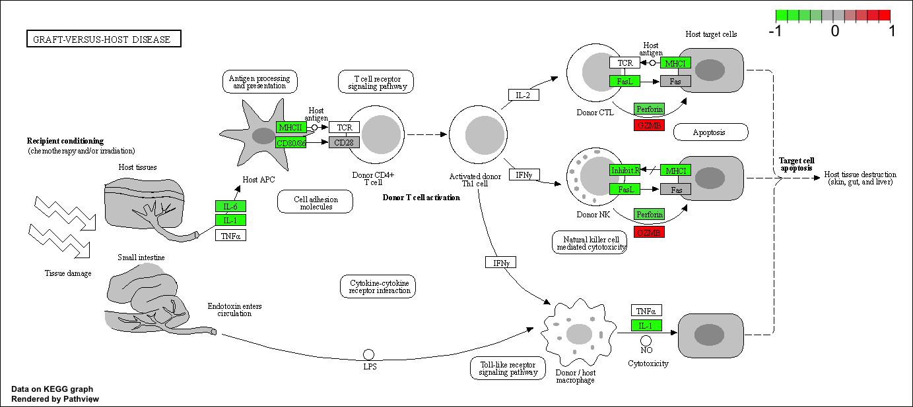
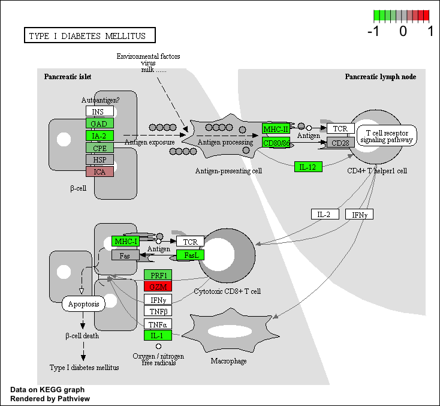

This week we are looking at differential expression analysis. 

The data for this hands-on session comes from a published RNA-seq experiment where airway smooth muscle cells were treated with dexamethasone, a synthetic glucocorticoid steroid with anti-inflammatory effects (Himes et al. 2014).

## Import/Read the data from Himes et al. 

```{r}
counts <- read.csv("airway_scaledcounts.csv", row.names = 1 )
metadata <- read.csv("airway_metadata.csv")
```

Lets have a wee peak at the metadata file. 

```{r}
head(metadata)
```

Lets do a little sanity check on the correspondence of counts on metadata 

```{r}
all(metadata$id == colnames(counts))
```
> Q1. How many genes are in this dataset? 

There are `r nrow(counts)` genes in this dataset 

> Q2. How many ‘control’ cell lines do we have?

```{r include=FALSE}
n.control <- sum(metadata$dex == "control")
```

We have `r n.control` control cell lines in this dataset. 

# Toy differential gene expression

Lets perform some exploratory differential gene expression analysis. Note: this analysis is for demonstration only. NEVER do differential expression analysis this way!

Note that the control samples are SRR1039508, SRR1039512, SRR1039516, and SRR1039520. This bit of code will first find the sample id for those labeled control. Then calculate the mean counts per gene across these samples:

```{r}
control <- metadata[metadata[,"dex"]=="control",]
control.counts <- counts[ ,control$id]
control.mean <- rowSums( control.counts )/4 
head(control.mean)
```

An alternative method is using the dplyr package: 
```{r}
library(dplyr)
control <- metadata %>% filter(dex=="control")
control.counts <- counts %>% select(control$id) 
control.mean <- rowSums(control.counts)/4
head(control.mean)
```
> Q3. How would you make the above code in either approach more robust?

## Extract and summarize the control samples 

To find out where the control samples are we need the metadata 

```{r}
control <- metadata[metadata$dex == "control",]
control.counts <- counts[, control$id]
control.mean <- rowMeans(control.counts)
head(control.mean)
```

> Q4. Follow the same procedure for the treated samples (i.e. calculate the mean per gene across drug treated samples and assign to a labeled vector called treated.mean)

Lets repeat the procedure for the treated columns. 

```{r}
n.treated <- sum(metadata$dex == "treated")
```

We have `r n.treated` treated cell lines in this dataset

## Extract and summarize the treated (i.e drug) samples 

```{r}
treated <- metadata[metadata$dex == "treated",]
treated.counts <- counts[,treated$id]
treated.mean <- rowMeans(treated.counts)
head(treated.mean)
```

We will combine our meancount data for bookkeeping purposes. We will store these results together in a dataframe called `meancounts`

```{r}
meancounts <- data.frame(control.mean, treated.mean)
```

> Q5 (a). Create a scatter plot showing the mean of the treated samples against the mean of the control samples.

Lets make a plot to explore the results a little 

```{r}
plot(meancounts[,1], meancounts[,2])
```

> Q5 (b).You could also use the ggplot2 package to make this figure producing the plot below. What geom_?() function would you use for this plot?

We would use a geom_point() function for this plot 

```{r}
library(ggplot2)
ggplot(meancounts) + aes(control.mean, treated.mean) + geom_point() 
```

Wait a sec. There are 60,000-some rows in this data, but I’m only seeing a few dozen dots at most outside of the big clump around the origin.

> Q6. Try plotting both axes on a log scale. What is the argument to plot() that allows you to do this?

We will make a log-log plot to draw out this skewed data and see whats going on. 

We can add the log = "xy" argument to plot() that will allow us to do this. 

```{r}
plot(meancounts[,1], meancounts[,2], log = "xy", xlab = "log control counts", ylab = "log treated counts")
```

We can repeat the same for ggplot using the scale_x_continuous and scale_y_continuous function: 

```{r}
library(ggplot2)
ggplot(meancounts) + aes(control.mean, treated.mean) + geom_point() + scale_x_continuous(trans="log2") + scale_y_continuous(trans="log2")
```

We often use log2 transformations when dealing with this sort of data. 

```{r}
# No effect of drug, so effect remains the same
log2(20/20)
# Suppose drug enhances things: 
log2(40/20)
# Suppose drug inhibits things: 
log2(20/40)
# What if the scale is different? 
log2(80/20)
```

This log2 transformation has this nice property where if there is no change then the log2 value will be zero and if it doubles we will have a log2 value of 1 and if halved it will be -1. 

So lets add log2 fold change column to our results so far. 

```{r}
meancounts$log2fc <- log2(meancounts$treated.mean/meancounts$control.mean)
head(meancounts)
```

We need to get rid of zero count genes that we cannot say anything about

```{r}
zero.vals <- which(meancounts[,1:2]==0, arr.ind=TRUE)
to.rm <- unique(zero.vals[,1])
mycounts <- meancounts[-to.rm,]
head(mycounts)
```
> Q7. What is the purpose of the arr.ind argument in the which() function call above? Why would we then take the first column of the output and need to call the unique() function?

The purpose of the arr.ind argument is to return only the location of those genes in the dataframe that have either the control.mean = 0 or treated.mean = 0. We then need to call the unique function to get rid of any duplicate genes so each gene location is only mentioned once. 

How many genes are remaining? 

```{r}
nrow(mycounts)
```

A common threshold used for calling something differentially expressed is a log2(FoldChange) of greater than 2 or less than -2. Let’s filter the dataset both ways to see how many genes are up or down-regulated.

```{r}
up.ind <- mycounts$log2fc > 2
down.ind <- mycounts$log2fc < -2
```

> Q8. Using the up.ind vector above can you determine how many up regulated genes we have at the greater than 2 fc level?

```{r}
sum(up.ind)
```

There are `r sum(up.ind)` upregulated genes 

```{r}
sum(down.ind)
```

There are `r sum(down.ind)` downregulated genes 

There are clearly more number of downregulated genes than upregulated genes

> Q10. Do you trust these results? Why or why not?

We cannot trust these results as we are entirely basing our results on a threshold we created. Fold change is very important, but we haven't looked at the statistic aspect and whether the fold change is significant. We haven't looked at the p-values, so we can't tell that the change is significant or not. 

# DESeq2 analysis

Let’s do this the right way. DESeq2 is an R package specifically for analyzing count-based NGS data like RNA-seq. It is available from Bioconductor. Bioconductor is a project to provide tools for analyzing high-throughput genomic data including RNA-seq, ChIP-seq and arrays. 

```{r}
# Load up DESeq2 

library(DESeq2)
dds <- DESeqDataSetFromMatrix(countData=counts, 
                              colData=metadata, 
                              design=~dex)
dds
```

```{r}
dds <- DESeq(dds)
```
```{r}
res <- results(dds)
res
```

We can visualize this in a table using this function: 
```{r}
resview <- as.data.frame(res)
head(resview)
```

We can get some basic summary tallies using the `summary` function. 

```{r}
summary(res, alpha = 0.05)
```

## Adding Annotation Data 

Our result table so far only contains the Ensembl gene IDs. However, alternative gene names and extra annotation are usually required for informative interpretation of our results. In this section we will add this necessary annotation data to our results.

We will use one of Bioconductor’s main annotation packages to help with mapping between various ID schemes. Here we load the AnnotationDbi package and the annotation data package for humans org.Hs.eg.db.

```{r}
#biocmanager::install("AnnotationDbi")
#biocmanager::install("org.Hs.eg.db")
library("AnnotationDbi")
library("org.Hs.eg.db")
```

The later of these is is the organism annotation package (“org”) for Homo sapiens (“Hs”), organized as an AnnotationDbi database package (“db”), using Entrez Gene IDs (“eg”) as primary key. To get a list of all available key types that we can use to map between, use the columns() function:

```{r}
columns(org.Hs.eg.db)
```
The main function we will use from the AnnotationDbi package is called mapIds().

We can use the mapIds() function to add individual columns to our results table. We provide the row names of our results table as a key, and specify that keytype=ENSEMBL. The column argument tells the mapIds() function which information we want, and the multiVals argument tells the function what to do if there are multiple possible values for a single input value. Here we ask to just give us back the first one that occurs in the database.

```{r}
res$symbol <- mapIds(org.Hs.eg.db, keys = row.names(res), keytype = "ENSEMBL", column = "SYMBOL", multiVals = "first") #our gene names , the format of our gene names, the new format we want to add, and we want the code to give us back the first value that occurs in the database incase of multiple input values. 
```
lets look at the results obtained: 

```{r}
head(res)
```
> Q11) Run the mapIds() function two more times to add the Entrez ID and UniProt accession and GENENAME as new columns called res$entrez, res$uniprot and res$genename.

First, lets add the Entrez ID: 

```{r}
res$entrez <- mapIds(org.Hs.eg.db, keys = row.names(res), keytype = "ENSEMBL", column = "ENTREZID", multiVals = "first" )
```

Then lets do it for Uniprot:

```{r}
res$uniprot <- mapIds(org.Hs.eg.db, keys = row.names(res), keytype = "ENSEMBL", column = "UNIPROT", multiVals = "first")
```

and finally for Genename: 

```{r}
res$genename <- mapIds(org.Hs.eg.db, keys = row.names(res), keytype = "ENSEMBL", column = "GENENAME", multiVals = "first")
```

You can arrange and view the results by the adjusted p-value: 

```{r}
ord <- order(res$padj)
#View(res[ord,])
head(res[ord,])
```
Finally, let’s write out the ordered significant results with annotations. See the help for ?write.csv if you are unsure here.

```{r}
write.csv(res[ord,], "deseq_results.csv")
```

# Volcano Plot 

Make a summary plot of our results: 

```{r}
plot(res$log2FoldChange, -log(res$padj))
```

The genes that change a lot have a higher level of change 

To color the points we will setup a custom color vector indicating transcripts with large fold change and significant differences between conditions:

```{r}
# Setup our custom point color vector 
mycols <- rep("gray", nrow(res))
mycols[ abs(res$log2FoldChange) > 2 ]  <- "red" 

inds <- (res$padj < 0.01) & (abs(res$log2FoldChange) > 2 )
mycols[ inds ] <- "blue"

# Volcano plot with custom colors 
plot( res$log2FoldChange,  -log(res$padj), 
 col=mycols, ylab="-Log(P-value)", xlab="Log2(FoldChange)" )

# Cut-off lines
abline(v=c(-2,2), col="gray", lty=2)
abline(h=-log(0.1), col="gray", lty=2)
```

For even more customization you might find the EnhancedVolcano bioconductor package useful (Note. It uses ggplot under the hood):

```{r}
#BiocManager::install("EnhancedVolcano")
library(EnhancedVolcano)
x <- as.data.frame(res,)

EnhancedVolcano(x,
    lab = x$symbol,
    x = 'log2FoldChange',
    y = 'pvalue')
```

## Pathway Analysis

Pathway analysis (also known as gene set analysis or over-representation analysis), aims to reduce the complexity of interpreting gene lists via mapping the listed genes to known (i.e. annotated) biological pathways, processes and functions.

There are many freely available tools for pathway or over-representation analysis. Ath the time of writting Bioconductor alone has over 80 packages categorized under gene set enrichment and over 120 packages categorized under pathways.

Here we play with just one, the GAGE package (which stands for Generally Applicable Gene set Enrichment), to do KEGG pathway enrichment analysis on our RNA-seq based differential expression results.

```{r}
library("pathview")
library("gage")
library("gageData")

data("kegg.sets.hs")

# Examine the first 2 pathways in this kegg set for humans

head(kegg.sets.hs,2)
```

The main gage() function requires a named vector of fold changes, where the names of the values are the Entrez gene IDs.

Note that we used the mapIDs() function above to obtain Entrez gene IDs (stored in res$entrez) and we have the fold change results from DESeq2 analysis (stored in res$log2FoldChange).

```{r}
foldchanges = res$log2FoldChange
names(foldchanges) = res$entrez
head(foldchanges)
```

Now, let’s run the gage pathway analysis.

```{r}
# Get the results
keggres = gage(foldchanges, gsets = kegg.sets.hs)
```

Now lets look at the object returned from gage().

```{r}
attributes(keggres)
```

It is a list with three elements, “greater”, “less” and “stats”.

You can also see this in your Environmnet panel/tab window of RStudio or use the R command str(keggres).

Like any list we can use the dollar syntax to access a named element, e.g. head(keggres$greater) and head(keggres$less).

Lets look at the first few down (less) pathway results:

```{r}
head(keggres$less, 3)
```

Each keggres$less and keggres$greater object is data matrix with gene sets as rows sorted by p-value.

The top three Kegg pathways indicated here include Graft-versus-host disease, Type I diabetes and the Asthma pathway (with pathway ID hsa05310).

Now, let’s try out the pathview() function from the pathview package to make a pathway plot with our RNA-Seq expression results shown in color.
To begin with lets manually supply a pathway.id (namely the first part of the "hsa05310 Asthma") that we could see from the print out above.

```{r}
pathview(gene.data = foldchanges, pathway.id = "hsa05310")
```
You can play with the other input arguments to pathview() to change the display in various ways including generating a PDF graph. For example:

```{r}
# A different PDF based output of the same data
pathview(gene.data = foldchanges, pathway.id = "hsa05310", kegg.native = FALSE)

```

> Q12) Can you do the same procedure as above to plot the pathview figures for the top 2 down-reguled pathways?

Repeating the procedure using different hsa values: in this case we have hsa05332 and hsa04940 

```{r}
pathview(gene.data=foldchanges, pathway.id="hsa05332")
```



```{r}
pathview(gene.data=foldchanges, pathway.id="hsa04940")
```


## Optional: Plotting counts for genes of interest

DESeq2 offers a function called plotCounts() that takes a DESeqDataSet that has been run through the pipeline, the name of a gene, and the name of the variable in the colData that you’re interested in, and plots those values. See the help for ?plotCounts. Let’s first see what the gene ID is for the CRISPLD2 gene using:

```{r}
i <- grep("CRISPLD2", res$symbol)
res[i,]
```
```{r}
rownames(res[i,])
```

Now, with that gene ID in hand let’s plot the counts, where our intgroup, or “interesting group” variable is the “dex” column.

```{r}
plotCounts(dds, gene = "ENSG00000103196", intgroup = "dex")
```

That’s just okay. Keep looking at the help for ?plotCounts. Notice that we could have actually returned the data instead of plotting. We could then pipe this to ggplot and make our own figure. Let’s make a boxplot.

```{r}
d <- plotCounts(dds, gene="ENSG00000103196", intgroup="dex", returnData=TRUE)
head(d)

```

We can mow use this returned object to plot a boxplot with the base graphics function boxplot()

```{r}
boxplot(count ~ dex , data=d)
```

As the returned object is a data.frame it is also all setup for ggplot2 based plotting. For example:

```{r}
library(ggplot2)
ggplot(d) + aes(dex, count, fill = dex) + geom_boxplot() + scale_y_log10() + ggtitle("CRISPLD2")
```

##Session Information

The sessionInfo() prints version information about R and any attached packages. It’s a good practice to always run this command at the end of your R session and record it for the sake of reproducibility in the future.

```{r}
sessionInfo()
```


```